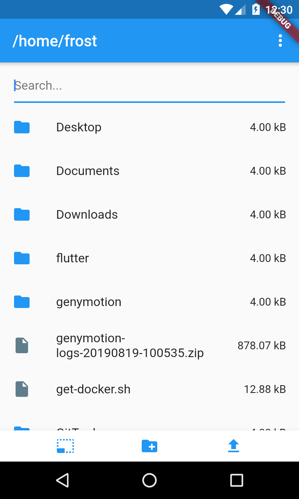
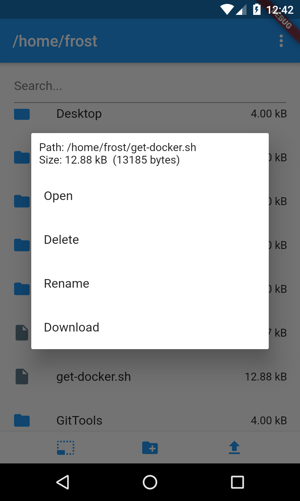
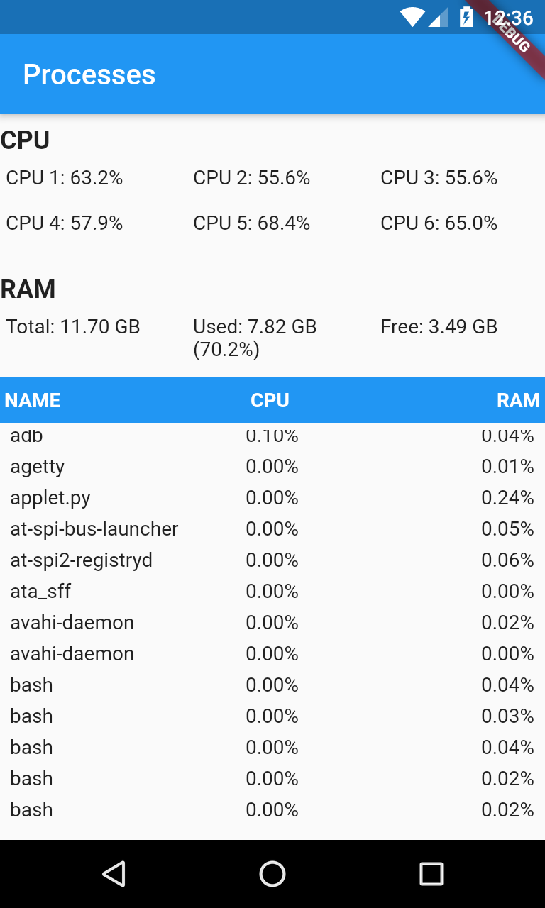

App para acessar um PC remotamente

Comandos disponiveis

- Listar, baixar, abrir e enviar arquivos
- Baixar diretorios compactados
- Criar diretorio
- Deletar e renomear arquivos e diretorios
- Listar e terminar processos
- Screenshot

  

Servidor: https://github.com/arthurdm10/remote-pc-server

Client: https://github.com/arthurdm10/remote-pc-client
